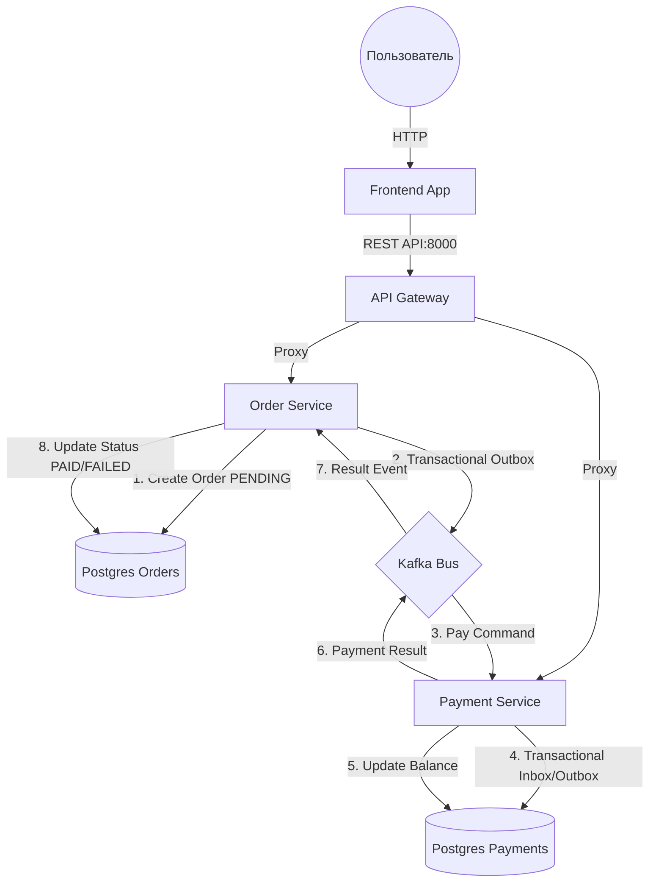

# Проект Gozon

---

## Что реализовано в проекте

1.  **API Gateway (Шлюз):** Единая точка входа. Отвечает только за маршрутизацию (routing) запросов к нужным сервисам.
2.  **Order Service (Сервис заказов):** Управляет созданием заказов, просмотром списка и статуса каждого заказа.
3.  **Payment Service (Сервис платежей):** Отвечает за создание счета, пополнение баланса и просмотр остатка средств.
4.  **Kafka (Шина данных):** Брокер сообщений, обеспечивающий асинхронную доставку событий с гарантией **at-least-once**.
5.  **Frontend (Веб-интерфейс):** Отдельный сервис для визуального управления системой и мониторинга заказов.

---

## Схема взаимодействия сервисов



## Реализация паттернов из ТЗ

Для достижения семантики **effectively exactly once**  
(списание денег строго один раз за заказ) в системе реализованы следующие подходы:

### Transactional Outbox (Orders & Payments)
Гарантирует, что сообщение в Kafka будет опубликовано **только после успешного коммита транзакции в базе данных**.  
Исключает потерю событий при падении сервиса.

### Transactional Inbox (Payments)
Позволяет сервису платежей:
- отслеживать уже обработанные сообщения,
- игнорировать дубликаты,
- обеспечивать **идемпотентную обработку команд**.

### Exactly-once семантика
Достигается комбинацией:
- Inbox-таблицы (идемпотентность сообщений),
- атомарных SQL-операций (`CAS / UPDATE ... WHERE balance >= amount`) при списании средств.

### Database per Service
Каждый микросервис владеет собственной базой данных:
- нет прямых зависимостей между Orders и Payments,

---

## Структура и документация

Каждый сервис автономен и содержит собственный `README.md`:

- `./api-gateway/README.md` — маршрутизация, CORS, проксирование
- `./order-service/README.md` — бизнес-логика заказов, Outbox Relay
- `./payment-service/README.md` — управление балансом, Inbox / Outbox

---

## Описание API (эндпоинты)

Все запросы проходят через **API Gateway**  
и требуют заголовок:

```http
X-User-Id: <user_id>
```


### Payments Service

* **POST /accounts**: Создание счета (не более одного на пользователя).
* **GET /accounts/balance**: Просмотр текущего баланса счета.
* **POST /accounts/deposit**: Пополнение счета.

---

### Orders Service

Согласно спецификации Swagger:

* **POST /orders**: Создание нового заказа.
* **GET /orders**: Получение списка заказов пользователя.
* **GET /orders/{id}**: Получение информации о заказе и его статусе.

---

### Порты и доступ к системе

| Сервис | Адрес | Описание |
| :--- | :--- | :--- |
| **Frontend** | `http://localhost:3000` | Пользовательский интерфейс |
| **API Gateway** | `http://localhost:8000` | Точка входа для всех API запросов |
| **Swagger UI** | `http://localhost:8082` | Интерактивная документация API |
| **Kafka Broker** | `localhost:9092` | Брокер сообщений |

---

### Запуск проекта


#### Запуск
В корне проекта выполните:
```bash
docker-compose up --build
```

Frontend: http://localhost:3000

Swagger UI: http://localhost:8082