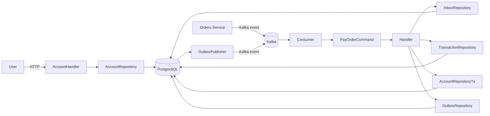

# Payment Service

Payment Service — микросервис, отвечающий за управление счетами пользователей
и обработку оплаты заказов в системе интернет-магазина.

Сервис предоставляет:
- синхронное HTTP API для работы со счетом пользователя
- асинхронную обработку оплаты заказов через брокер сообщений
- гарантии корректности списания средств при высокой нагрузке
- защиту от дублирующихся сообщений и повторных списаний

## Структура проекта

```
## Структура проекта

payment-service/
├── cmd/                        # Точка входа приложения
│   └── main.go                 # Инициализация HTTP, Kafka, БД
│
├── internal/
│   ├── application/            # Application Layer (use-cases)
│   │   ├── command/            # Команды, изменяющие состояние системы
│   │   │   ├── interfaces.go   # Порты (интерфейсы) для репозиториев
│   │   │   └── pay_order.go    # Use-case оплаты заказа
│   │   │
│   │   └── query/              # Query layer (чтение данных)
│   │       └── account_query.go# Получение баланса пользователя
│   │
│   ├── domain/                 
│   │   ├── account/            # Домен "Счет пользователя"
│   │   │   ├── account.go      # Агрегат Account 
│   │   │   ├── repository.go   # Интерфейс репозитория счета
│   │   │   └── errors.go       # Доменные ошибки
│   │   │
│   │   └── payment/            # Домен "Платежи"
│   │       └── transaction.go  # Доменная сущность платежа
│   │
│   └── infrastructure/         # Infrastructure Layer (адаптеры)
│       ├── http/               # HTTP delivery layer
│       │   └── account_handler.go
│       │                         # REST API для работы со счетом
│       │
│       ├── messaging/          # Работа с брокером сообщений
│       │   ├── kafka_consumer.go
│       │   │                     # Получение команд оплаты заказов
│       │   └── outbox_publisher.go
│       │                         # Публикация событий из Outbox
│       │
│       └── persistence/        # Хранилище данных (PostgreSQL)
│           ├── account_repo.go # Реализация AccountRepository
│           ├── inbox_repo.go   # Transactional Inbox
│           ├── transaction_repo.go
│           │                     # Хранение информации о платежах
│           └── outbox_repo.go  # Transactional Outbox
│
├── migrations/                 # SQL-миграции базы данных
│   └── 001_init.sql
│
├── config/                     # Конфигурационные файлы
│
├── docker-compose.yml          # Запуск сервиса и зависимостей
├── Dockerfile                  # Docker-образ сервиса
├── swagger.yaml                # Swagger / OpenAPI описание HTTP API
└── go.mod                      # Go-модуль и зависимости
```

## Функциональность Payment Service

### Синхронные сценарии (HTTP)
- Создание счета пользователя (не заявляется более одного счета на пользователя)
- Пополнение счета
- Просмотр текущего баланса

### Асинхронные сценарии (через брокер сообщений)
- Обработка команды оплаты заказа
- Списание средств со счета пользователя
- Публикация события об успешной или неуспешной оплате заказа


## Общая архитектура Payments Service


---

## Архитектурные гарантии

- Kafka обеспечивает **at-least-once delivery**
- Transactional Inbox защищает от повторной обработки сообщений
- Проверка `order_id` обеспечивает **exactly-once списание**
- Атомарное обновление баланса предотвращает race condition
- Transactional Outbox гарантирует доставку доменных событий
- Потеря сообщений и двойное списание средств исключены
```


## HTTP API Payment Service

Во всех HTTP-запросах идентификатор пользователя передаётся
через заголовок `X-User-Id`.
| Метод | Endpoint            | Описание                         | Headers        | Body                | Ответ |
|------:|---------------------|----------------------------------|----------------|---------------------|-------|
| POST  | `/accounts`         | Создание счёта пользователя      | `X-User-Id`    | —                   | `201 Created` |
| POST  | `/accounts/deposit` | Пополнение счёта                 | `X-User-Id`    | `{ amount: number }`| `200 OK` |
| GET   | `/accounts/balance` | Получение баланса пользователя   | `X-User-Id`    | —                   | `200 OK` |

## Асинхронное API (Kafka)

| Тип | Topic                  | Producer        | Consumer        | Описание |
|----:|------------------------|-----------------|-----------------|----------|
| Command | `pay.order`          | Orders Service  | Payments Service| Команда на оплату заказа |
| Event   | `order.paid`         | Payments Service| Orders Service  | Заказ успешно оплачен |
| Event   | `order.payment_failed` | Payments Service| Orders Service  | Ошибка оплаты заказа |
